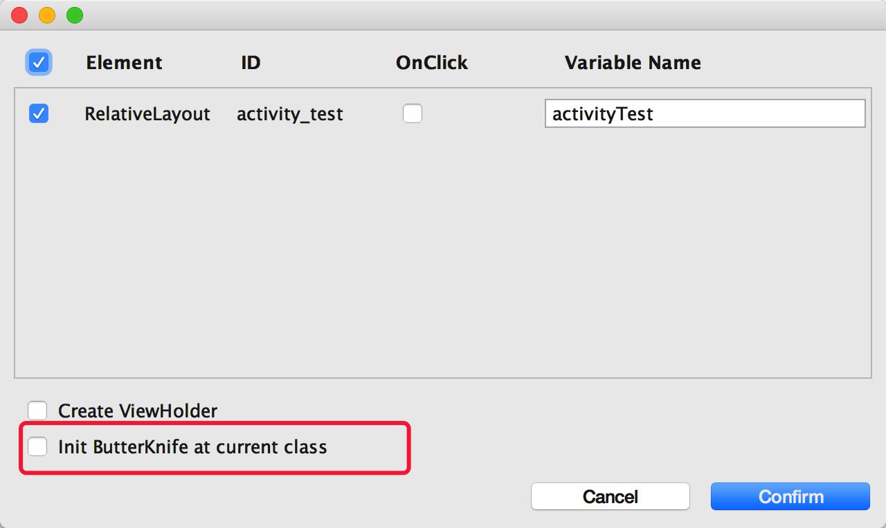
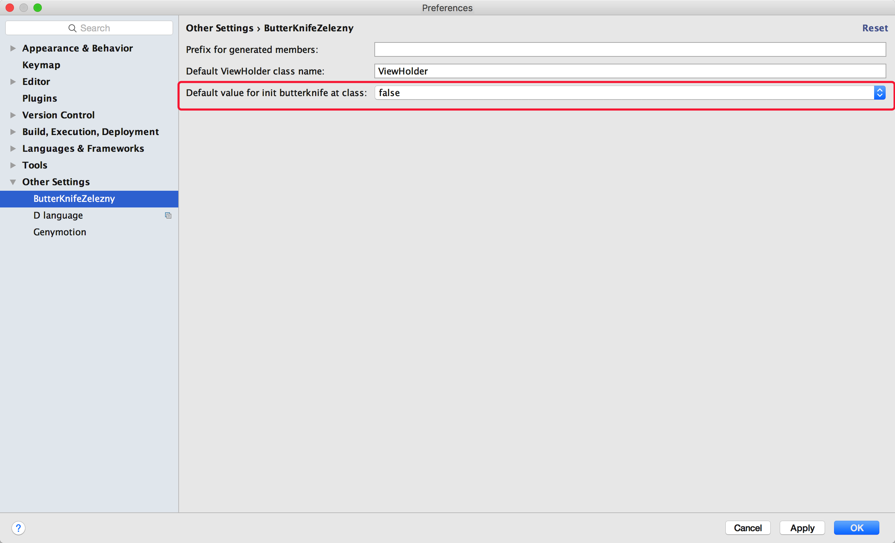

# Android-ButterKnife-Plugin-Plus

# 介绍

​	Android studio 的插件，方便快速实现ButterKnife注解框架，包含了[**android-butterknife-zelezny**](https://github.com/avast/android-butterknife-zelezny) 1.6版本的所有功能，并在此基础上新增如下功能：

1. 可以自由选择是否在当前类中对ButterKnife进行初始化，避免了原版本只要使用插件初始化控件会自动在onCreate中进行ButterKnife.bind(this)的尴尬。

   

   - 这样就可以在基类中进行ButterKnife的初始化，不必要每个类中都要初始化，对开发框架的搭建更加方便。

2. 在Android Studio的设置界面，对在当前类中是否强制初始化提供了默认值设置，这样就可以让插件使用更符合自己的操作习惯。

   

# 如何使用

* 直接在Android Studio中搜索安装即可使用。(**可能与作者原来的插件有冲突，请卸载原来的插件方可使用**)

  如何搜索安装？在AS中按照如下：Preferences->Plugins->Browse Repositories 进入插件搜索安装界面：

  

  搜索插件名称：Android ButterKnife Plugin Plus 安装即可使用。

* 直接下载[Android-ButterKnife-Plugin-Plus.jar](https://raw.githubusercontent.com/OriginalLove/Android-ButterKnife-Plugin-Plus/master/Android-ButterKnife-Plugin-Plus.jar)，下载好后在AS中按照如下：Preferences->Plugins->Install plugin from disk 然后选择刚才下载的jar安装即可。

# 鸣谢

* [**@**Tomas Kypta](https://github.com/avast/android-butterknife-zelezny) 
* [@JakeWharton](https://github.com/JakeWharton/butterknife)

